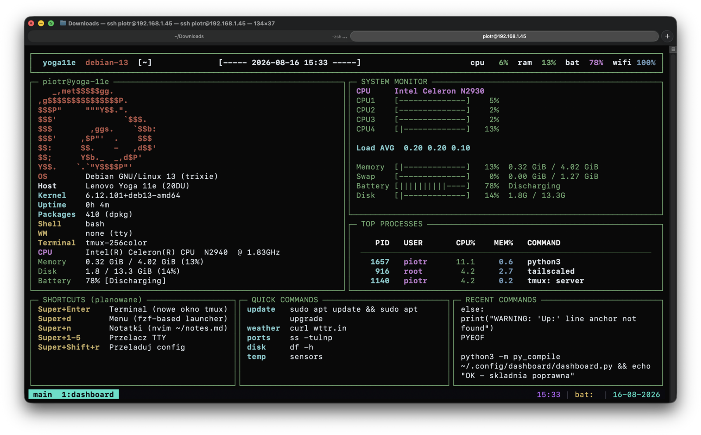

<div align="center">

# yoga11e-cyberdeck

**Dziesięcioletni Lenovo Yoga 11e, okrojony do czystego terminalowego dashboardu.**

Bez X11. Bez Waylanda. Bez środowiska graficznego. Tylko `tty1`, `tmux` i Python.

[](https://www.debian.org/)
[](https://www.python.org/)
[](https://github.com/tmux/tmux)
[](https://tailscale.com/)
[](LICENSE)

[🇬🇧 English](README.md)&nbsp;&nbsp;|&nbsp;&nbsp;🇵🇱 Polski

</div>

---

## Czym to jest

`yoga11e-cyberdeck` zamienia starego Lenovo Yoga 11e (Bay Trail, Celeron N2940, 4 GB RAM) w
dedykowaną, stale włączoną konsolę terminalową — żywy dashboard systemowy, który bootuje prosto
w pełnoekranowy `tty1`, bez ekranu logowania, bez żadnej warstwy graficznej.

Pomysł jest prosty: sprzęt jest zbyt słaby i zbyt stary, żeby wygodnie udźwignąć nowoczesny
desktop, ale w zupełności wystarcza, żeby być estetycznym, gęstym w informacje terminalem.

## Zrzuty ekranu

Dashboard działający na `tty1`, widziany przez SSH — pełny SYSTEM MONITOR
z baterią, dyskiem:



## Stos technologiczny

- **Debian 13 (trixie)** — czysta konsola, bez żadnego serwera graficznego
- **Python 3 + [`rich`](https://github.com/Textualize/rich)** — sam dashboard
- **tmux** — sesja przetrwa rozłączenie SSH
- **systemd** — autologin ograniczony wyłącznie do `tty1` (`tty2`–`tty6` zostają czystym loginem)
- **Tailscale** — dostęp do reszty floty urządzeń, status widoczny na żywo na dashboardzie

## Funkcje

- Panel informacji systemowych na żywo (OS, kernel, uptime, pakiety, CPU, pamięć, dysk, bateria)
- ASCII logo Debiana, kolorowane zgodnie ze stanem sprzętu/oprogramowania
- Obciążenie per-rdzeń CPU, paski pamięci/swapu/baterii/dysku — kolorowane progowo (zielony → żółty → czerwony)
- Przepustowość sieci (up/down)
- Sprawdzanie dostępności innych maszyn w sieci Tailscale na żywo
- Tabela najbardziej obciążających procesów
- Panele ze skrótami / szybkimi komendami / historią ostatnich komend
- Autologin ograniczony do `tty1` — pozostałe wirtualne terminale (`Alt`+`F2`..`F6`) zostają nietknięte do normalnej pracy

## Sprzęt

| | |
|---|---|
| Model | Lenovo Yoga 11e (20DU) |
| CPU | Intel Celeron N2940 (Bay Trail, 4 rdzenie) @ 1.83 GHz |
| RAM | 4 GB |
| Dysk | eMMC |
| WiFi | Intel Wireless 7260 (`iwlwifi`) |

Sprzęt z ery Bay Trail ma opinię kapryśnego pod Linuksem. W praktyce, na Debianie 13 jedyne
realne przeszkody to:
- `iw` leży w `/usr/sbin`, co nie jest domyślnie w `$PATH` zwykłego użytkownika — wywołuj pełną ścieżką
- firmware WiFi dla karty 7260 jest już dołączony przez `non-free-firmware` w nowoczesnych instalatorach Debiana
- trzymaj zarówno Ethernet, jak i WiFi pod NetworkManagerem (`managed=true`) — inaczej DNS będzie się
  psuł przy przełączaniu między nimi

## Instalacja

```bash
sudo apt install -y python3-rich python3-psutil tmux figlet cmatrix curl

mkdir -p ~/.config/dashboard ~/.config/tmux
cp dashboard.py       ~/.config/dashboard/dashboard.py
cp tmux.conf          ~/.config/tmux/tmux.conf
cp boot.sh            ~/.config/tmux/boot.sh
cp session.sh         ~/.config/tmux/session.sh
chmod +x ~/.config/dashboard/dashboard.py ~/.config/tmux/*.sh
echo "source-file ~/.config/tmux/tmux.conf" >> ~/.tmux.conf

cat profile-snippet.sh >> ~/.bash_profile

sudo mkdir -p /etc/systemd/system/getty@tty1.service.d
sudo cp getty-override.conf /etc/systemd/system/getty@tty1.service.d/override.conf
# najpierw popraw nazwę użytkownika wewnątrz getty-override.conf
sudo systemctl daemon-reload
sudo systemctl restart getty@tty1
```

Zmień w `dashboard.py` `THINKCENTRE_HOST` / `ORANGEPI_HOST` (albo dodaj własne) na nazwy hostów,
jakie pokazuje `tailscale status` w Twojej własnej sieci.

## Architektura

```
        yoga11e (tty1)
             |
        sesja tmux
             |
        dashboard.py
             |
       sieć Tailscale
     /       |        \
 server   orangepipc2  ...
(ThinkCentre)
```

## Licencja

MIT — zobacz [LICENSE](LICENSE).
